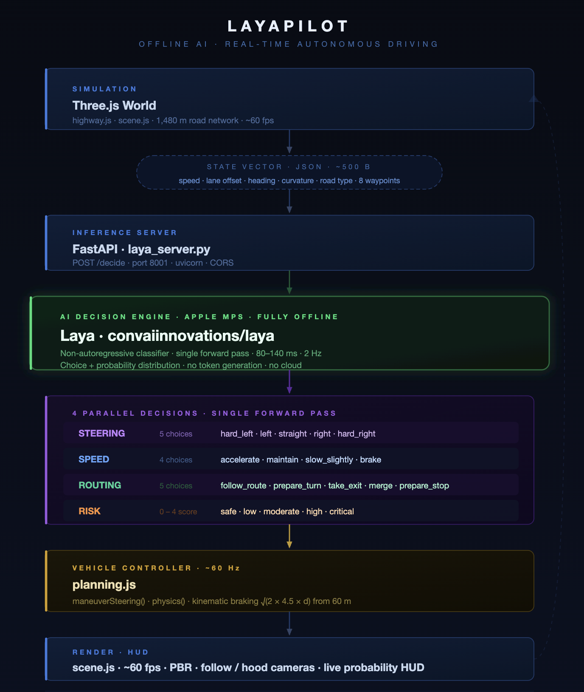

# LayaPilot

A real-time autonomous driving simulator running a fully offline, open-source AI decision engine on Apple Silicon. Built as a vertical prototype of a JEVPilot-style system - structured world state in, typed driving decisions out, at awesome inference frequency.

[Watch Demo Here](https://www.youtube.com/watch?v=cARKE6S4AXk)

---

## What This Is ?

LayaPilot demonstrates that a **non-autoregressive, open-source language model can serve as a real-time System 1 driving brain** - making steering, speed, routing, and risk decisions continuously, with no cloud dependency, no proprietary API, and no GPU server.

The model is **Laya** (`convaiinnovations/laya`), a classifier-style architecture that answers structured questions about the world rather than generating free text. This makes it deterministic, fast, and directly mappable to vehicle control outputs — properties that matter for safety-critical systems.

---




## Metrices

| Metric | Value |
|---|---|
| Laya inference latency | **80 - 140 ms** per decision cycle |
| Decision frequency | **2 Hz** (every 500 ms, non-blocking) |
| Render loop | **~60 fps** (requestAnimationFrame, capped at 50 ms/frame) |
| Physics integration | **~60 Hz** (same render tick, dt-stepped) |
| State vector size | **~500 bytes** JSON per request |
| Decisions per question | 4 questions answered in a **single model call** |
| Route computation (A\*) | **< 1 ms** over 30-node graph |
| World geometry | **1,480 m** total road network, 9 highway nodes + 20 connector nodes |
| Full route length | **~2.1 km** Millbrook → Interstate 08 → Cedar Town |
| Speed limit — interstate | **28 m/s (100 km/h)** |
| Speed limit — local / town | **10 m/s (36 km/h)** |
| Destination braking onset | **60 m** from stop line |
| Braking deceleration | **4.5 m/s²** (kinematic: `v = √(2 × 4.5 × d)`) |
| Full stop threshold | **1.5 m** from stop line |
| Steering lookahead | **10 – 25 m**, scaled linearly with speed (`speed × 1.0`) |
| Minimum speed floor | **5 m/s** — enforced on all non-final-approach decisions |
| Model size on disk | Laya base weights (downloaded once, cached locally) |
| Backend dependencies | `laya[serve]`, `fastapi`, `uvicorn`, `truststore` |
| Frontend dependencies | `three`, `vite` — zero runtime cloud calls |

---

## What Laya Is

Laya is a **non-autoregressive classifier model** from Convai Innovations, designed for structured decision-making rather than text generation. Key properties relevant to autonomous systems:

- **Non-autoregressive**: answers all questions in a single forward pass, not token-by-token. This is why latency is bounded and predictable rather than proportional to output length.
- **Choice + probability output**: each answer returns the selected choice *and* a full probability distribution over all options. The HUD visualises these distributions live — the model's confidence is observable, not hidden.
- **Structured input**: the model receives a JSON state object, not a natural language prompt. This eliminates prompt engineering variability and makes the input/output contract explicit and testable.
- **Runs on MPS**: Apple's Metal Performance Shaders backend. No CUDA, no cloud, no data leaving the device.
- **Open weights**: `convaiinnovations/laya` is publicly available. The full inference stack is reproducible from `requirements.txt`.

This is architecturally distinct from using a general-purpose LLM (GPT-4, Claude, Gemini) for driving decisions. Those models are autoregressive, have unbounded latency, require network calls, and are not designed for real-time control loops.

---

## World Model

The simulated world (`highway.js`) is a procedurally generated road network with realistic geometry:

- **Millbrook** - a two-lane town grid with stop-controlled junctions, 10 m/s limit
- **Interstate 08** - a sinusoidal 8-node highway, 28 m/s limit, Catmull-Rom smoothed centerline
- **On-ramp** - cubic Bézier merge geometry, speed ramps from 8 → 26 m/s across the ramp length
- **Exit ramp** - lane-split geometry at h6, 22 m/s limit, cubic Bézier to off-ramp
- **Cedar Town** - destination town with cross-streets, buildings, street lights, stop line

Road types exposed to Laya: `interstate`, `local`, `onramp`, `merge`, `exit`, `offramp`, `town`, `ramp_turn`.

Route geometry uses **right-hand lane offsets** (9 m from centerline on interstate), Catmull-Rom spline smoothing at 2 m sample resolution, and cubic Bézier corner blending at junctions.

---

## Route Selection

A 2D canvas map (`/map.html`) lets the user pick any source and destination node before the simulation starts. Pathfinding uses **A\*** over the directed graph, respecting one-way edges (on-ramp, merge lane, exit ramp). Valid destinations are computed via BFS from the selected origin. The computed route is passed to the simulation via `sessionStorage` and reconstructed into full 3D geometry at startup.

---

## Decision Pipeline in Detail

Every 500 ms, while autopilot is active:

1. `getStateForLaya()` samples the route centerline at 8 distances (10 m – 80 m ahead), computes lane offset, heading error, curvature at 30 m and 60 m, identifies the nearest upcoming junction and road-type transition.
2. The state JSON is `POST`ed to `http://127.0.0.1:8001/decide`.
3. Laya answers all 4 questions in one forward pass and returns choices + probability distributions.
4. `STEER_MAP` converts the steering choice to a signed steering value: `{ hard_left: -0.55, left: -0.22, straight: 0.0, right: 0.22, hard_right: 0.55 }`.
5. `targetSpeed()` converts the speed + routing choices to a target m/s, with routing overrides distance-gated to prevent premature triggering (e.g. `prepare_stop` only active within 30 m of destination).
6. `applyLayaDecision()` writes a maneuver struct to the vehicle; `maneuverSteering()` computes the geometric steering correction each physics tick from the lookahead point on the route.
7. The physics integrator runs at ~60 Hz, independent of the 2 Hz Laya loop , the vehicle tracks the last issued maneuver smoothly between decisions.

---

## Destination Arrival

The final approach is handled by a kinematic braking override that activates at 60 m from the stop line, independent of Laya:

```
target_speed = min(current_target, √(2 × 4.5 × distance_m))
```

At 1.5 m, speed is zeroed and `sim.arrived` is set. Laya polling stops. The HUD shows `✓ Arrived at [destination]` in green.

---

## Running Locally

**Requirements**: Apple Silicon Mac · Python 3.10+ · Node.js 18+

```bash
# Terminal 1 — Laya inference server
cd layapilot
python3 -m venv .venv && source .venv/bin/activate
pip install -r requirements.txt
LAYA_DEVICE=mps python laya_server.py
```

```bash
# Terminal 2 — Vite frontend
cd layapilot
npm install && npm run dev
```

Open `http://localhost:5173`. Press `J` to engage Laya autopilot. Press `M` to open the route map.

**Controls**: `W/S` accelerate/brake · `A/D` steer · `J` toggle autopilot · `V` toggle camera · `M` route map

---

## What Works !

- Laya running live on MPS: continuous `POST /decide HTTP/1.1 200 OK` every 500 ms confirmed in `/tmp/laya.log`
- Full route completion: Millbrook → Interstate 08 → Cedar Town, kinematic stop at destination
- Route selection: A\* map UI, any valid source/destination pair, one-way edge enforcement
- Real-time HUD: steering probabilities, speed state, routing action, risk score, inference latency, mini-map
